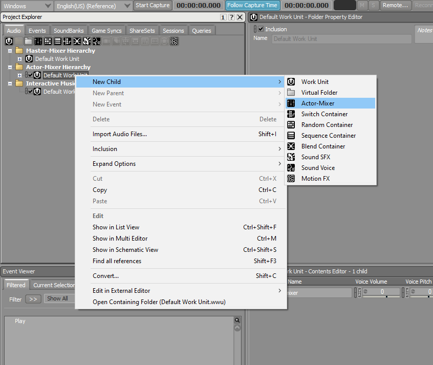
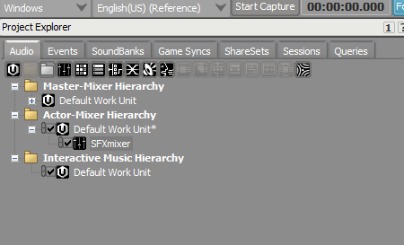
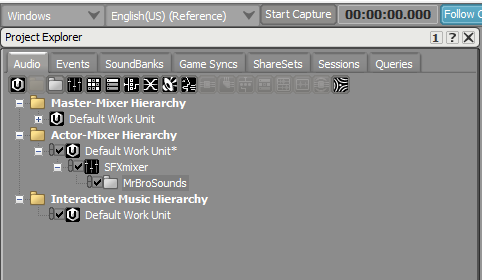
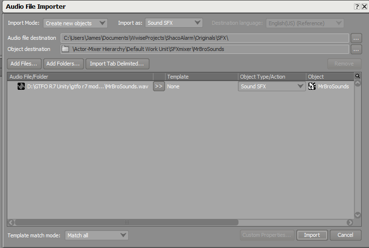
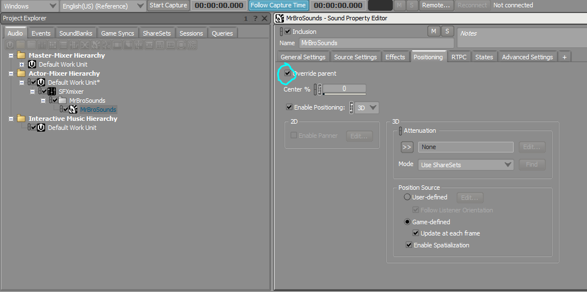
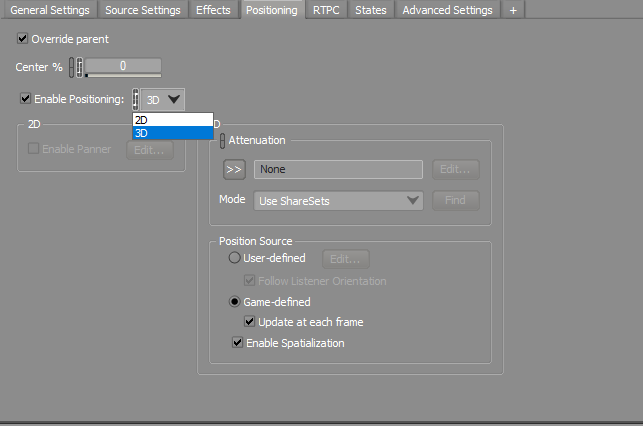

# Adding Sounds into Wwise

**Step 1:** In the project explorer, right-click on the Default Work Unit in the Actor-Mixer Hierarchy, and in "New Child", select "Actor-Mixer". Name this Actor-Mixer "SFXmixer"

<figure><figcaption></figcaption></figure>

<figure><figcaption></figcaption></figure>

**Step 2:** Right-click SFXmixer and create a new folder, and name it whatever you want. We will be putting all our sounds into this folder.

<figure><figcaption></figcaption></figure>

**Step 3:** Drag your **.wav** files directly into this folder in the hierarchy inside Wwise. It should prompt you with import settings, click import.

<figure><figcaption></figcaption></figure>

**Step 4:** Click on your sound, and in the Sound Property Editor, click on the "Positioning" tab. Check the "Override parent" box.

<figure><figcaption></figcaption></figure>

**Step 6:** Change the positioning to "3D". (Note: You can change the volume of your sound, or make your sound loop continuously in the "General Settings" tab)

<figure><figcaption></figcaption></figure>
