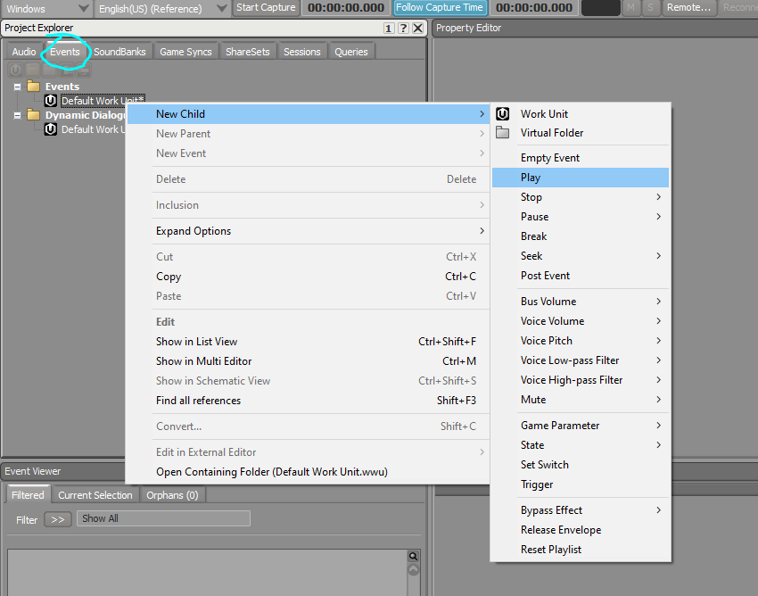
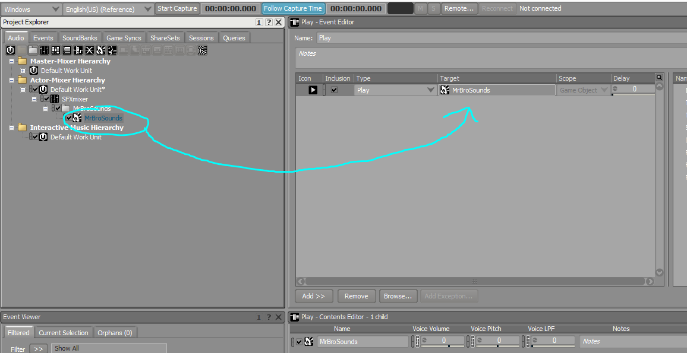

# Creating a Sound Event

**Step 1:** In the "Events tab", click on the "Default Work Unit" in the "Events" folder, and create a new "Play" sound event. **Click on the "Play" sound event you created.**

<figure><figcaption></figcaption></figure>

**Step 2:** Click back onto the "Audio" tab, and drag your sound from the hierarchy into the "Target" box into the "Play" event in the Event Editor. (Note: This event editor will only display given you clicked on the "Play" event in the Events tab)

<figure><figcaption></figcaption></figure>

