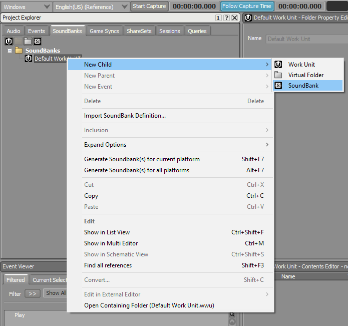

# Creating a SoundBank

**Step 1:** Click on the "SoundBanks" tab, right-click the "Default Work Unit", and create a new Soundbank. After doing this, press F7 to open the SoundBank Manager, or press the "Layouts" tab in the window menu. You can press F5 to close the Manager, or use the aforementioned tab.

<figure><figcaption></figcaption></figure>

**Step 2:** Click on the "Events" tab, and drag your "Play" sound event into the SoundBank Editor.

If you want to create more sound events, you can drag them into the same soundbank. This includes "Stop" events, which will stop a sound playing, which is necessary for stopping looping sounds. (e.g. Door alarms)

<figure><figcaption></figcaption></figure>

**Step 3:** To export the SoundBank, right-click the SoundBank in the SoundBank Manager, and "Generate SoundBank(s) for current platform", or press Shift-F7.

<figure><figcaption></figcaption></figure>

**Step 4:** To view your SoundBank file, right-click the SoundBank in the SoundBank Manager, and select the last option in the drop down menu, "Open Containing Folder".

You should end up with two files, the **.bnk** file (the SoundBank itself), and a **.txt** file, containing your Event IDs. This **.txt** file is necessary for using your SoundBank.
