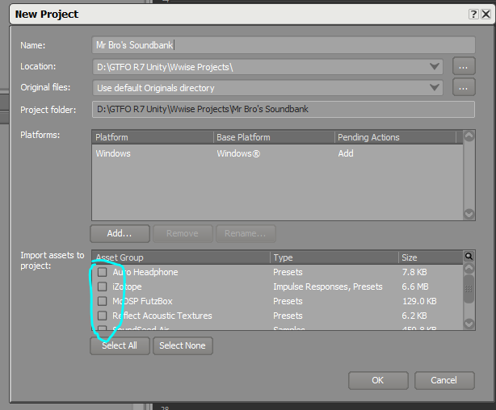

# Project Setup

**Step 1:** Download the Wwise launcher from the link below. From inside the launcher, download Wwise version **2017.1.9.6501**.



You also probably want to use audacity to convert audio files to the **.wav** file format, because that's what Wwise requires. The download link is below.



**Step 2:** Using Wwise version **2017.1.9.6501** create a new project, and uncheck all of the asset groups, none are required for our SoundBanks.

<figure><figcaption></figcaption></figure>
