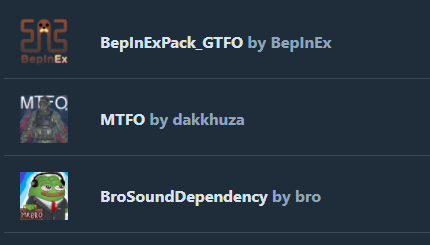

# Using SoundBanks in GTFO

**Step 1:** Add BepInExPack\_GTFO, MTFO (if you don't have them already), and BroSoundDependency mod as a dependency to your profile/mod.

<figure><figcaption></figcaption></figure>

**Step 2:** In your profile, add the **.bnk** and **.txt** file to the path:

```
(Profile)/
└──BepInEx/
    └──assets/
        └──SoundBank/
           └──(your soundbanks)
```

(Create the "assets" and "SoundBank" folder if they don't exist)

**Step 3:** Use the sound event ID inside the **.txt** file to put into MTFO datablocks to use your sound ingame. Make sure to use the **sound event ID** (highlighted below) which is located on the upper half of the file, not the **audio ID** which is located on the lower half of the file.

<figure><figcaption></figcaption></figure>

This sound event ID can be used in in-game events, as well as:

GameData\_EnemySFXDataBlock\_bin

GameData\_ChainedPuzzleDataBlock\_bin

GameData\_MeleeSFXDataBlock\_bin

There's also a DataBlock for weapon sound effects, but ¯\\\_(ツ)\_/¯


Mr Bro out
