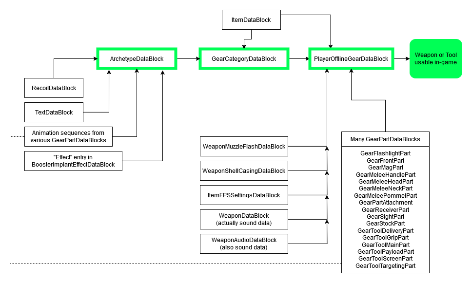
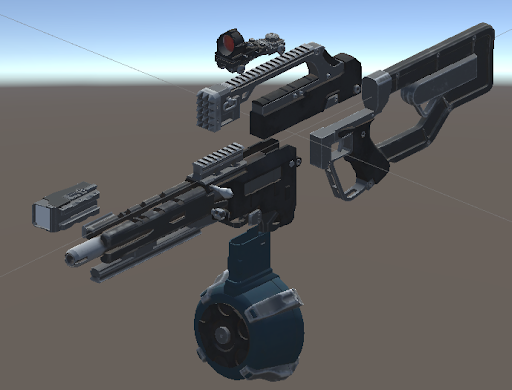
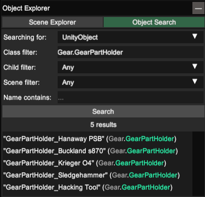
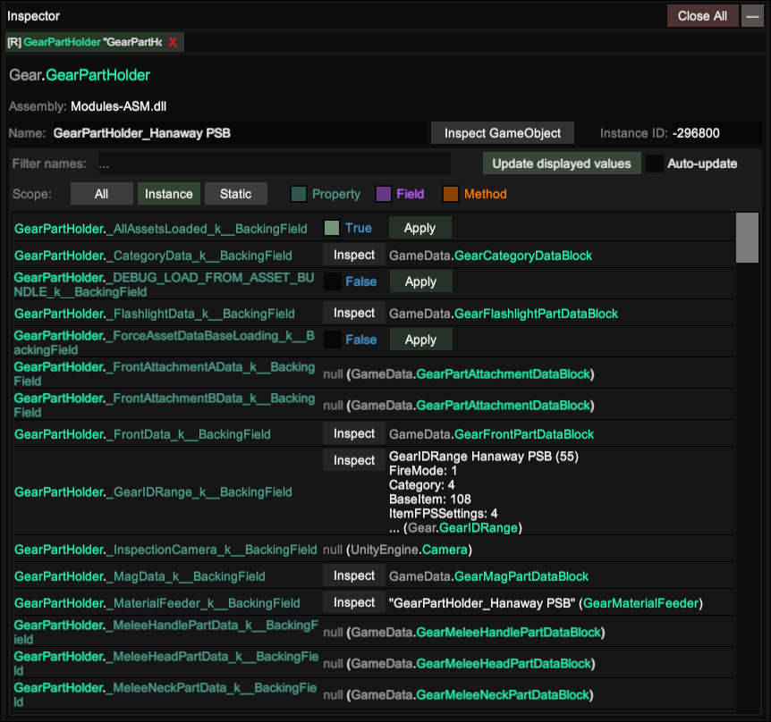
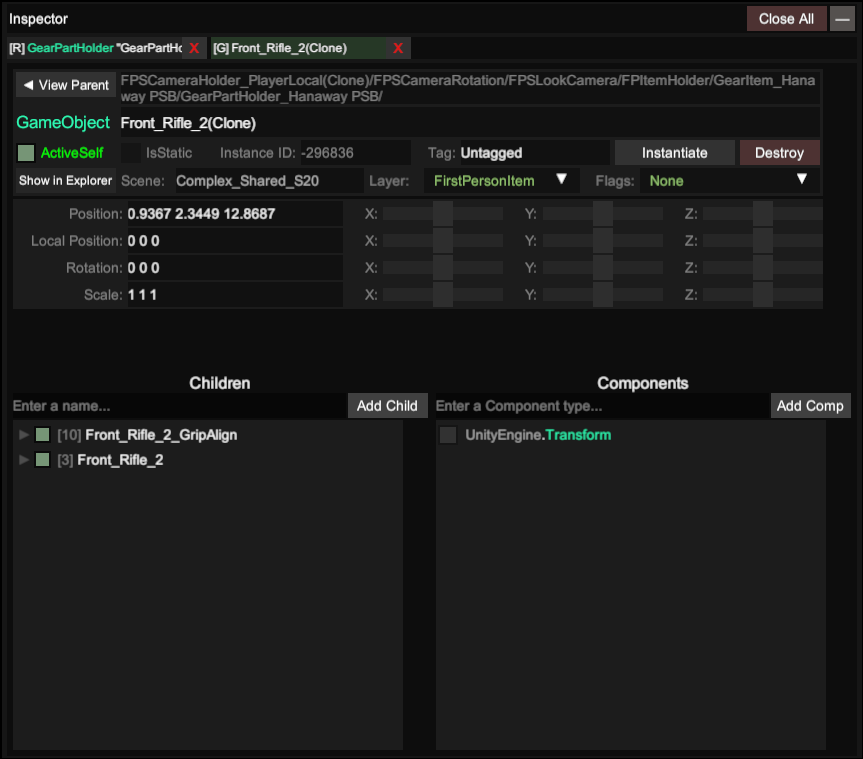

# Creating Custom Weapons

> Most information below this point has been reproduced from [Mccad00's "How to make custom weapons for GTFO" guide](https://docs.google.com/document/d/1vnMhPE5eB0xHsHEETj7XGD_f8hyjYRoweNfqpdeNDxQ/edit), with updates, additions, and clarifications.
>
> In most, if not all cases, information from the actual DataBlock pages on this wiki is marginally more up-to-date than whatever is reproduced in this guide - please refer to the DataBlock pages if there are discrepancies.

In GTFO, weapons are composed of a large number of DataBlocks which provide stats, determine behavior, recoil data, and configure their appearance.

<figure><figcaption><p>Fortunately, you only really have to understand the green-highlighted entries in this chart.</p></figcaption></figure>

Before going any further, it’s important that you understand what main DataBlocks contain weapon data, and what data are in each.

* [**PlayerOfflineGearDataBlock**](../reference/datablocks/main/playerofflinegear.md): Creates an inventory object that players can select in the lobby and then use in-game by defining a collection of 3d objects (weapon parts) and associating them with data from a [GearCategoryDataBlock](../reference/datablocks/main/gearcategory.md) entry, as well as some other DataBlock entries.
* [**GearCategoryDataBlock**](../reference/datablocks/main/gearcategory.md): Groups together 4[ ArchetypeDataBlock](../reference/datablocks/main/archetype.md) entries and 1 [ItemDataBlock](../reference/datablocks/main/item.md) entry.
* [**ArchetypeDataBlock**](../reference/datablocks/main/archetype.md): Defines weapon statistics and associates a [RecoilDataBlock](../reference/datablocks/main/recoil.md) entry with them, in addition to referencing other metadata.
* [**ItemDataBlock**](../reference/datablocks/main/item.md): Defines what inventory slot a piece of equipment uses, controls its HUD elements, and defines what type of Item it is.

> Note: There will be some DataBlock information reproduced in this guide. For clarity, inline comments have been added. Again, please refer to the actual datablock pages for more detail.

## **Archetype**

At the heart of every weapon in GTFO is the [ArchetypeDataBlock](../reference/datablocks/main/archetype.md), which determines a gun’s statistics and metadata. Like most DataBlocks, there are many fields and not all of them are always relevant.

This is a very terse guide to this DataBlock - please see the actual [ArchetypeDataBlock](../reference/datablocks/main/archetype.md) page for more details.

```json
"PublicName": //Weapon inventory name, PersistentID or String
"Description": //Weapon lobby description, PersistentID or String
"FireMode": //How the weapon shoots:
            //0 - Semiauto (one shot per trigger pull)
            //1 - Burst (multiple sequential shots per trigger pull)
            //2 - Auto (continuous fire as long as trigger is held)
            //3 - SemiBurst (unused but functional, see ArchtypeDataBlock for details)
"RecoilDataID": //Weapon recoil settings, references a PersistentID in RecoilDatablock
"DamageBoosterEffect": //Determines what boosters affect this weapon.
                       //See "Effect" field in BoosterImplantEffectDataBlock
"Damage": //Weapon base damage
"DamageFalloff": { // see ArchetypeDataBlock for more details
    "x": //Falloff begins
    "y": //Falloff ends
},
"StaggerDamageMulti": //Multiplier to get weapon's stagger damage
"PrecisionDamageMulti": //Multiplier for shots that hit an enemy's weakpoint
"DefaultClipSize": //Number of shots in a magazine
"DefaultReloadTime": //Time in seconds to reload
"CostOfBullet": //Total ammo capacity, see ArchetypeDataBlock for more details
"ShotDelay": //Time in seconds between each shot
"PiercingBullets": //Whether this weapon's projectiles pierce though enemies
"PiercingDamageCountLimit": //See ArchetypeDataBlock for more details 
"HipFireSpread": //Size of the accuracy cone when hipfiring, not degrees
"AimSpread": //Size of the accuracy cone when aiming, not degrees
"EquipTransitionTime": //Time in seconds to equip the weapon
"EquipSequence": //Animation sequence to play when equipping the weapon
                 //(see later section on AnimationSequences for more details) 
"AimTransitionTime": //Time in seconds to aim down sights
"AimSequence": //Animation sequence to play when aiming the weapon
               //(see later section on AnimationSequences for more details)
"BurstDelay": //Delay in seconds between bursts
"BurstShotCount": //Number of shots to fire in a burst
"ShotgunBulletCount": //Number of pellets to fire if the weapon is a shotgun
"ShotgunConeSize": //Radius of the shotgun’s cone (Integer)
"ShotgunBulletSpread": //Spread between each pellet (Integer)
"SpecialChargetupTime": //Time it takes to charge up before firing this weapon
"SpecialCooldownTime": //Time it takes to cool down after firing this weapon
"SpecialSemiBurstCountTimeout": //Unused or broken
"Sentry_StartFireDelay": //Time before a sentry starts firing
"Sentry_RotationSpeed": //Sentry rotation speed
"Sentry_DetectionMaxRange": //Maximum distance a sentry can target enemies at
"Sentry_DetectionMaxAngle": //Angle of the sentry's sweep in degrees
"Sentry_FireTowardsTargetInsteadOfForward": //see ArchetypeDataBlock for details
"Sentry_LongRangeThreshold": //Unused?
"Sentry_ShortRangeThreshold": //Unused?
"Sentry_LegacyEnemyDetection": //Use the new or old sentrygun targeting behavior
"Sentry_FireTagOnly": //Only shoot at biotracker tagged enemies, True/False
"Sentry_PrioTag": //Prioritize biotracked enemies, True/False
"Sentry_StartFireDelayTagMulti": //Multipliers when firing at biotracked enemies,
"Sentry_RotationSpeedTagMulti":  //see ArchetypeDataBlock for more details
"Sentry_DamageTagMulti":         //...
"Sentry_StaggerDamageTagMulti":  //...
"Sentry_CostOfBulletTagMulti":   //...
"Sentry_ShotDelayTagMulti":      //...
"name": //The weapon’s internal name in the files, unused
"internalEnabled": //Is weapon enabled in-game
"persistentID": //Weapon’s ID for reference in other DataBlocks
```

> Note: Any new weapon Archetype you create needs a unique PersistentID for its data. Keep track of this ID as you’ll be using it in the GearCategory DataBlock.

## **GearCategory**

Perhaps the most baffling DataBlock involved in custom weapons and gear is the GearCategory DataBlock. The GearCategory system is designed to group together 4 archetype DataBlock entries into one category and assigns them an entry in the Item Datablock, which is used to assign the weapons behavior on the HUD and a slot in the inventory to fit into. Let’s take a look at an example.

```json
"PublicName": "", //In-game name for other gear, not used by weapons
"Description": "", //Lobby description for other gear, not used by weapons
"BaseItem": 108, //PersistentID in ItemDataBlock of this weapon's base item
"HUDIcon": "", //Unused
"FPSArmPoseName": "", //Unused
"ThirdPersonFullbodyMovement": 0, //Animation set to use, see GearCategoryDataBlock
"SemiArchetype": 1,         //0th archetype in this category
"BurstArchetype": 3,	    //1st archetype in this category
"AutoArchetype": 5,	    //2nd archetype in this category
"SemiBurstArchetype": 16,   //3rd archetype in this category
/*
These refer to the PersistentIDs of gun behavior entries in ArchetypeDataBlock.
You only need the correct PersistentID for the firemode your gun actually uses.
Weapon firemode is selected in its PlayerOfflineGearDataBlock GearJSON.
*/
"PartAlignPriority": [], //Determines how parts with conflicting aligns behave.
"name": "Rifle", //Internal name, unused
"internalEnabled": true, //Whether or not this category is enabled ingame
"persistentID": 1 //Category ID for reference in other DataBlocks
```

> Note: Any new GearCategory you create needs a unique PersistentID for its data. Keep track of this PersistentID so you can reference it in the PlayerOfflineGearDataBlock.

#### **GearCategoryDataBlock: PartAlignPriority**

Sometimes, multiple parts in a GearJSON will share the same aligns as each other, which will result in one of the parts defaulting to have that align. In order to control which parts get the align in cases like this, we need to edit the PartAlignPriority in the GearCategoryDataBlock. The GearCategory which is linked to your weapon via the ‘Category’ component type will determine which GearCategory you need to modify for this. Let’s look at the Magnum’s part align priority to see how it works:

```json
"PartAlignPriority": [
{
    "AlignType": 7,
    "PartPrio": [
    12
    ]
},
{
    "AlignType": 8,
    "PartPrio": [
    12
    ]
}
],
```

`"AlignType":`\
This corresponds to the Enum that is used by Aligns in the GearDataBlocks.

`"PartPrio":`\
A list of gear component types, ordered by priority. This determines which part to assign this align to.

So, this set of align priorities means that align types 7 and 8 (LeftHand and RightHand) are both going to prioritize part 12. From this setup, we can guess that this is probably necessary so that both hands align on the grip.

## **PlayerOfflineGear**

In GTFO, almost every piece of equipment is assembled programmatically to get more mileage out of the limited assets the game shipped with.

<figure><figcaption><p>An exploded view of a gun, illustrating the various parts used to create it</p></figcaption></figure>

Weapons, tools, and even some consumables are put together using this system. For the sake of simplicity, we will refer to these assembled items as ‘Gear’. Every assembled Gear item in GTFO is set up in the PlayerOfflineGearDataBlock via a string called GearJSON.&#x20;

### **GearJSON formatting**

To start, let’s break down the GearJSON string for the Pistol:

> Note: Line breaks have been added into this string for the explanation, but in _your_ DataBlock the entire string must be on a single line with no linebreaks.

```json
"GearJSON":
"{\"Ver\":1,\"Name\":\"Shelling S49\",
\"Packet\":{\"Comps\":{\"Length\":16,
\"a\":{\"c\":2,\"v\":8},
\"b\":{\"c\":3,\"v\":108},
\"c\":{\"c\":4,\"v\":8},
\"d\":{\"c\":5,\"v\":1},
\"e\":{\"c\":6,\"v\":1},
\"f\":{\"c\":7,\"v\":1},
\"g\":{\"c\":8,\"v\":16},
\"h\":{\"c\":9,\"v\":15},
\"i\":{\"c\":10,\"v\":27},
\"j\":{\"c\":11,\"v\":27},
\"k\":{\"c\":12,\"v\":38},
\"l\":{\"c\":16,\"v\":1001},
\"m\":{\"c\":19,\"v\":1002},
\"n\":{\"c\":23,\"v\":8},
\"o\":{\"c\":25,\"v\":3}},
\"MatTrans\":{\"tDecalA\":{\"position\":{\"x\":-0.098,\"y\":-0.07},\"scale\":0.05},
\"tDecalB\":{\"position\":{\"x\":-0.098,\"y\":-0.07},\"scale\":0.04},
\"tPattern\":{\"position\":{\"x\":-0.09,\"y\":-0.03},\"angle\":-90.0,\"scale\":0.1}},
\"publicName\":{\"data\":\"Shelling S49\"}}}",
```

`"{\"Ver\":1,\"Name\":\"Shelling S49\",`\
This line assigns the GearJSON a ‘descriptive name’, which is displayed in your inventory and in the lobby screen.

`\"Packet\":{\"Comps\":{\"Length\":16,`\
This line tells the game how many gear components your part contains. If this number doesn’t match the actual number of gear components, the game won’t read the GearJSON string correctly.

`\"a\":{\"c\":2,\"v\":8},`\
This line defines a gear component to add to our GearJSON, which is broken up into 3 values:

1. `\"a\"`\
   The index, in alphabetical order, of this gear component. Notice in our example that every component starts with a unique letter identifier.
2. `\"c\":2`\
   The component type, such as FrontPart, ReceiverPart, or StockPart. In this component, type is ‘2’ which corresponds to GearCategory. If you attempt to use the same component type on multiple components, only one of them will load.
3. `"V\":8`\
   The component value. This tells the game which component to load for a given type. In this component, since the type was GearCategory, this will load the GearCategory with persistentID 8.

The ending section of the GearJSON string, starting with `\"MatTrans\"`, is not used by the game.

You can have as many gear components as you want in a GearJSON, provided you use correct syntax to define them. Because of the complexity and obscurity of GearJSON strings, writing one from scratch is discouraged. Instead, duplicating and modifying an existing GearJSON from the base game is a simpler method that will save you time (and sanity).

#### **Gear Component Types**

> Note: Unused/Unusable component types are omitted.

<table><thead><tr><th width="72">ID</th><th width="171">Component Type</th><th>Description</th></tr></thead><tbody><tr><td>1</td><td>FireMode</td><td>0-3, determines which FireMode PersistentID to use from the GearCategory</td></tr><tr><td>2</td><td>Category</td><td>PersistentID of the GearCategoryDataBlock to load</td></tr><tr><td>3</td><td>BaseItem</td><td>PersistentID of the ItemDataBlock entry to load.</td></tr><tr><td>4</td><td>ItemFPSSettings</td><td>PersistentID of the ItemFPSSettings entry to load.</td></tr><tr><td>5</td><td>AudioSetting</td><td>PersistentID of the WeaponAudio entry to load</td></tr><tr><td>6</td><td>MuzzleFlash</td><td>PersistentID of the WeaponMuzzleFlash entry to load</td></tr><tr><td>7</td><td>ShellCasing</td><td>PersistentID of the WeaponShellCasing entry to load</td></tr><tr><td>12</td><td>FrontPart</td><td>The front, barrel portion of a weapon</td></tr><tr><td>16</td><td>ReceiverPart</td><td>The receiver of a weapon</td></tr><tr><td>19</td><td>StockPart</td><td>The grip or stock of a weapon</td></tr><tr><td>21</td><td>SightPart</td><td>The sight of a weapon; some front parts have this function built in</td></tr><tr><td>23</td><td>MagPart</td><td>The magazine of a weapon. Not all parts support this</td></tr><tr><td>25</td><td>FlashlightPart</td><td>The flashlight of a weapon</td></tr><tr><td>27</td><td>ToolMainPart</td><td>The base part which the rest of the tool parts align to</td></tr><tr><td>30</td><td>ToolGripPart</td><td>The grip or stock of a tool; this is interchangeable with StockPart</td></tr><tr><td>33</td><td>ToolDeliveryPart</td><td>Typically the business end of a tool</td></tr><tr><td>37</td><td>ToolPayloadPart</td><td>Varies widely between tools</td></tr><tr><td>40</td><td>ToolTargetingPart</td><td>The ‘targeting module’ placed on some tools</td></tr><tr><td>42</td><td>ToolScreenPart</td><td>The display screen, only functional if the gear uses the correct BaseItem</td></tr><tr><td>44</td><td>MeleeHeadPart</td><td>The head of a melee weapon</td></tr><tr><td>46</td><td>MeleeNeckPart</td><td>The part that connects the head to the handle of a melee weapon</td></tr><tr><td>48</td><td>MeleeHandlePart</td><td>The handle of a a melee weapon</td></tr><tr><td>50</td><td>MeleePommelPart</td><td>The base of the handle of a melee weapon</td></tr></tbody></table>

> Note: Even though the developers typically only used appropriate parts, you can actually use any of these parts on any piece of gear.

### **Gear Datablocks: General**

The gear DataBlocks are used to assign behavior, animations, models, and aligns to gear parts, for use in GearJSON. The most simple, and arguably the most important part of these DataBlocks is ‘General’, which tells the game what model and children to load, and what hand animations to use.

```json
"General": {
    "Model": "Assets/AssetPrefabs/Items/Gear/Parts/Fronts/Front_Short_Shotgun_2.prefab",
    "Children": [],
    "GearCategoryFilter": 0,
    "LeftHandGripAnim": "Short_Shotgun_2_Player_Idle",
    "RightHandGripAnim": "Short_Shotgun_2_Player_Idle",
    "AssetBundle": 20,
    "BundleShard": 3
},
```

`"Model":`\
The path of the part prefab to load

`"Children":`\
A list of child prefabs to load

`"GearCategoryFilter": 0,`\
Unused.

`"LeftHandGripAnim":`\
The animation clip to play for the player’s arms on layer 5

`"RightHandGripAnim":`\
The animation clip to play for the player’s arms on layer 6

`"AssetBundle": 20,`\
The asset bundle to load the prefabs from.

`"BundleShard": 3`\
The asset shard to load the prefabs from.

Generally, when copying prefabs into this DataBlock, it’s important to make sure you use the same AssetBundle and BundleShard as the prefab you copied.

### **Gear Datablocks: Aligns**

Gear parts are attached to each other using aligns, which are empty Game Objects placed onto gear parts which aligned parts are parented to. In order to change the usage of these aligns, you need to edit, or make a copy of the gear DataBlock entry for the desired part. Let’s look at the aligns of Front\_UZI\_1:

```json
"Aligns": [
    {
        "AlignType": 0,
        "AlignName": "Receiver_M"
    },
    {
        "AlignType": 1,
        "AlignName": "Front_SE"
    },
    {
        "AlignType": 2,
        "AlignName": "Front_Mag"
    },
    {
        "AlignType": 5,
        "AlignName": "Front_Flash"
    },
    {
        "AlignType": 7,
        "AlignName": "LeftHand"
    },
    {
        "AlignType": 6,
        "AlignName": "Sight_Align"
    },
    {
        "AlignType": 4,
        "AlignName": "Receiver_Sight"
    }
],
```

`"AlignType": 0,`\
The Type of the align, which determines which part attaches to this

`"AlignName": "Receiver_M"`\
The name of the game object which this align attaches parts to. Unfortunately, we can’t add or modify these game objects in this DataBlock, but we can tell the game what parts to place onto these aligns.

#### **Gear Datablocks: Align Types**

<table><thead><tr><th width="81">ID</th><th width="176">Align Type</th><th>Description</th></tr></thead><tbody><tr><td>0</td><td>Muzzle</td><td>Weapon’s muzzle flash</td></tr><tr><td>1</td><td>ShellEject</td><td>Weapon’s ejection port</td></tr><tr><td>2</td><td>Magazine</td><td>Corresponds to the MagPart gear component</td></tr><tr><td>4</td><td>Sight</td><td>Corresponds to the SightPart gear component</td></tr><tr><td>5</td><td>Flashlight</td><td>Corresponds to the FlashlightPart gear component</td></tr><tr><td>6</td><td>SightLook</td><td>The aim camera if no sight part is present</td></tr><tr><td>7</td><td>LeftHand</td><td>The player’s left hand</td></tr><tr><td>8</td><td>RightHand</td><td>The player’s right hand</td></tr><tr><td>9</td><td>Receiver</td><td>Corresponds to the ReceiverPart gear component</td></tr><tr><td>10</td><td>Front</td><td>Corresponds to the FrontPart gear component</td></tr><tr><td>12</td><td>ToolGrip</td><td>Corresponds to the ToolGripPart gear component</td></tr><tr><td>13</td><td>ToolDelivery</td><td>Corresponds to the ToolDeliveryPart gear component</td></tr><tr><td>14</td><td>ToolPayload</td><td>Corresponds to the ToolPayloadPart gear component</td></tr><tr><td>15</td><td>ToolTargeting</td><td>Corresponds to the ToolTargetingPart gear component</td></tr><tr><td>16</td><td>ToolScreen</td><td>Corresponds to the ToolScreenPart gear component</td></tr><tr><td>17</td><td>ToolDetection</td><td>Unknown</td></tr><tr><td>18</td><td>ToolScanning</td><td>Unknown</td></tr><tr><td>20</td><td>MeleeHead</td><td>Corresponds to the MeleeHeadPart gear component</td></tr><tr><td>40</td><td>RotationPivot</td><td>Presumably used by sentry guns to position the contained weapon parts</td></tr><tr><td>41</td><td>GroundPlacement</td><td>Presumably used to position the base of a sentry gun</td></tr></tbody></table>

### **Gear Datablocks: FireSequence and ReloadSequence**

To handle animations, the many Gear DataBlocks contain lists of WeaponAnimSequenceItems, which provide timing, behavior, and a string to reference the animation. Let’s look at the Short Shotgun reload sequence:

```json
"ReloadSequence": [
    {
        "TriggerTime": 0.0,
        "Type": 0,
        "StringData": "ShotgunReload_bump"
    },
    {
        "TriggerTime": 0.0,
        "Type": 5,
        "StringData": "carbine_reload_3_foley"
    },
    {
        "TriggerTime": 0.95,
        "Type": 5,
        "StringData": "shotgun_reload_1_shell_in"
    },
    {
        "TriggerTime": 1.0,
        "Type": 6
    },
    {
        "TriggerTime": 1.5,
        "Type": 5,
        "StringData": "shotgun_reload_2_cock"
    },
    {
        "TriggerTime": 2.0,
        "Type": 7
    }
],
```

`"TriggerTime": 0.0,`\
The delay, from the start of the sequence, to play the clip.

`"Type": 5,`\
The type, which determines the behavior of the animation.

`"StringData": "shotgun_reload_1_shell_in"`\
The string of the animation clip.

> Note: This formatting and behavior is consistent between reload and firing sequence.

#### **Gear Datablocks: Animation Types**

<table><thead><tr><th width="68">ID</th><th width="218">Animation Type</th><th>Description</th></tr></thead><tbody><tr><td>0</td><td>WeaponMovementAnim</td><td>Animate the first person weapon holder</td></tr><tr><td>1</td><td>FrontPartAnim</td><td>Animate the weapon’s front part</td></tr><tr><td>2</td><td>LeftHandAnim</td><td>Animate the FPS arms (animation layer 5)</td></tr><tr><td>3</td><td>LeftHandMagAnim</td><td>Animate the FPS arms using the magazine’s animation.<br>(No animation clip input required)</td></tr><tr><td>4</td><td>ReceiverAnim</td><td>Animate the weapon’s receiver part</td></tr><tr><td>5</td><td>Sound</td><td>Play a sound event using the animation string as a sound event ID</td></tr><tr><td>6</td><td>DoUpdateAmmo</td><td>Refill the weapon’s magazine.<br>(No animation clip input required)</td></tr><tr><td>7</td><td>Empty</td><td>Do nothing. Typically used at the end of a sequence.<br>(No animation clip input required)</td></tr><tr><td>8</td><td>StockAnim</td><td>Animate the weapon’s stock part</td></tr><tr><td>9</td><td>RightHandAnim</td><td>Animate the FPS arms (animation layer 6)</td></tr></tbody></table>

### **GearPartCustomization: Modifying gear part transforms**

By default, it is possible to use whatever weapon or tool parts you want on any gun, and to choose what aligns those parts snap to. However, it is not possible to adjust the position, scale, or rotation of parts.\
To get around this limitation, you can use the [GearPartCustomization plugin](https://gtfo.thunderstore.io/package/Frog/GearPartCustomization/), which allows you to modify the location, rotation, and scale of parts and get far more mileage out of them. Once the GearPartCustomization plugin is installed, it'll create a new file in your custom folder titled _GearPartTransform.json_.

Let’s take a look at the composition of this file.

```json
    "OfflineID": //PersistentID of the PlayerOfflineGear entry to customize
    "Name": //The name of the customization settings. (For organization, no effect)
    "InternalEnabled": //Whether or not to load this customization setting
    "Parts": //The list of parts to customize on this gear item.
```

Each entry in the **Parts** list is an object with the following properties:

```json
    "PartHolderObject": //Property within the GearPartHolder to modify
    "PartType": //Component Type to modify. (Only used if PartHolderObject is unset)
    "Enabled": //Enable or disable this Part’s GameObject (True/False)
    "PartTransform": //Modify Part's position, rotation, and scale
    "Children": /* The list of children on this part to modify.
    Many gear parts contain children for additional models, aligns, animations, etc.
    If you don’t want to customize this Part's children, leave this list empty. */`
```

Each entry in the **Children** list is an object with the following properties:

```json
    "ChildName": //The name of the child object to modify.
    "Enabled": //Enable or disable this child's GameObject (True/False)
    "PartTransform": //Modify child's position, rotation, and scale.
    "Children": /* Any Children of this object that we want to modify.
    Many parts have nested children multiple levels deep,
    so you need to modify the children of children to access those. */
```

This might seem daunting - you'll potentially be editing a very large amount of data, but thanks to [**Unity Explorer**](https://github.com/sinai-dev/UnityExplorer), this process is heavily simplified and relatively easy.

When you first boot up the game with [**Unity Explorer**](https://github.com/sinai-dev/UnityExplorer), you’ll see something like this.

<figure><figcaption><p>The R5-era Rundown screen, with Unity Explorer open</p></figcaption></figure>

For now, press **F7** to close the **Unity Explorer** menu. Pick a level, pick the gear you'd like to customize, and start the game.\
Once you've loaded into the level and are in control, open the **Unity Explorer** menu by pressing **F7**. Go to the **Object Explorer** window and and select **Object Search**.\
Set the scope of the search to **UnityObject**, the class filter to **Gear.GearPartHolder**, and click **Search**.

<figure><figcaption><p>Searching for GearPartHolder objects</p></figcaption></figure>

In our search results, you’ll find the **GearPartHolder** objects for everything in your character's current inventory. To continue, click on the **GearPartHolder** of the gear you want to customize.\
In this example, let's modify the **Hanaway PSB**.&#x20;

<figure><figcaption><p>Inspecting the Hanaway PSB's parts</p></figcaption></figure>

With the **GearPartHolder** open, you’ll be able to see all of the properties and fields of the GearPartHolder.\
You can also click **Inspect GameObject** to view the **GameObject** itself, where you can move, rotate, and scale the gun to make it easier to view your change while editing - for example, you can move it to the center of the screen so you can see it better.\
While there are many of fields here, very few of them are useful. Let’s inspect **GearPartHolder.FrontPart**.&#x20;

<figure><figcaption><p>Inspecting the Front_Rifle_2 GameObject</p></figcaption></figure>

You can now see the **FrontPart**’s global position, local position, rotation, and scale, as well as its attached child objects. Don't use the sliders to adjust these values - at the scale of this game, even minute adjustments to the sliders can move parts a tremendous distance.

> Note: To change where the gun is, don't change the global position, change the local position.

When you change the values for this weapon part, you can see that the weapon part is changed in-game as well. Once you’re happy with how it looks, you can input these values into your entry in the **GearPartTransform.json**.

## **ItemFPSSettings - First person weapon positioning**

To modify the position of weapons in the first person camera, you need to either assign an existing ItemFPSSetting entry (There are plenty of good ones in the base game) or write a custom one. Let’s look at an entry in the [ItemFPSSettingsDataBlock](../reference/datablocks/main/itemfpssettings.md):

```json
"localPosHip": //Position of the weapon while hipfiring
"localRotHip":	//Angle of the weapon while hipfiring
"localPosRelaxed": //Position of the weapon while in the idle animation
"localRotRelaxed": //Rotation of the weapon while in the idle animation
"localPosZoom": //Position of the weapon when aiming
"localRotZoom": //Rotation of the weapon when aiming
"bodyOffsetLocal": //Root position; other positions are offset from this
"bodyRotationOffsetLocal": //Root rotation; other rotations offset from this
"ItemCameraFOVDefault": //Default FOV of the Item Camera (renders only weapons/tools)
"ItemCameraFOVZoom": //Aimed FOV of the Item Camera (renders only weapons/tools)
"LookCameraFOVZoom": //Aimed FOV of the Player Camera (renders only the world)
"canAim": //Can this weapon enter the Aiming state, True/False
"onlyStartAimOnPressed": //Unused
"canRelax": //Can this weapon can play an idle animation?
"customDelayUntilRelax": //Time until this weapon plays an idle animation
"allowRotToAimPos": //Can weapon rotate when moving to the aimed position
"rotToAimPosMinDis": //Unused
"transitionToAim": //Speed of aim transition, 0 = quick, 1 = slow
"idleAnimData": //Animation used when player is stationary (ItemMovementAnimation)
"walkAnimData": //Animation used when player is walking (ItemMovementAnimation)
"runAnimData": //Animation used when player is stationary (ItemMovementAnimation)
"DofDefault": //The depth of field settings (camera blur) for hipfiring
"DofAim": //The depth of field settings (camera blur) when aiming
"name": //Internal name of these settings, unused
"internalEnabled": //Is this group of settings enabled in-game
"persistentID": //Unique ID of this ItemFPSSettings group
```

## **Best Practices and Notes**

**PersistentIDs:** Before you make a new weapon, it's wise to come up with an unused PersistentID and use that for everything associated with your weapon. You can reference the TextDataBlock for ideas on how large PersistentIDs can get, and be sure to search through all existing files to make sure you don't have any collisions.
