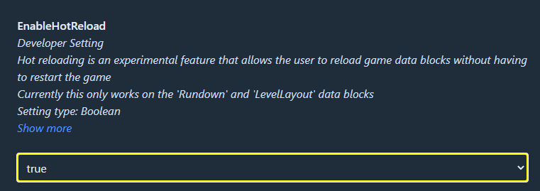
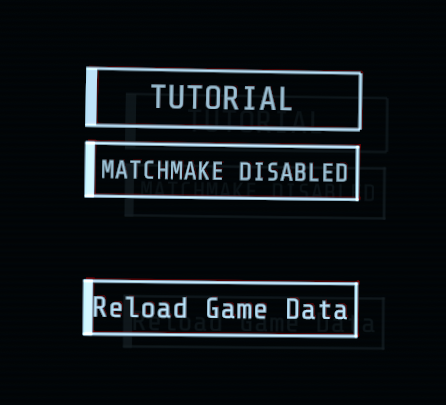

# Enabling MTFO Hot Reload

## Enabling MTFO Hot Reload


Hot reloading may not work for every datablock. If you make a change and nothing happens, you may need to restart the game instead. Additionally, hot reloading isn't quite the same as restarting your game, and may cause bugs. If in doubt, restart your game.


Hot reloading is a MTFO feature that allows you to reload datablocks without restarting the game. It can speed up your ability to test your changes quite considerably, and is definitely something you should strongly consider before trying to make your own datablock mods.

If you're using r2modman to manage your mods, then after creating a profile with MTFO (and launching the modded profile at least once to generate the config files) you can go to Config Editor in the r2modman profile, and then edit MTFO's config file.

<figure><figcaption>
Accessing MTFO's config.
</figcaption></figure>

Then simply set EnableHotReload to true and save.

<figure><figcaption>
The EnableHotReload setting in MTFO's config.
</figcaption></figure>

You can also edit the config file with any text editor as well.


Don't mind the description stating it only works for a few datablocks, it's outdated.


Now when you're in the game's level selection menus, a button will appear on the left that will reload your datablocks without having to restart the game.

<figure><figcaption>
The Reload Game Data button.
</figcaption></figure>
