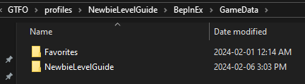
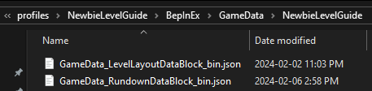
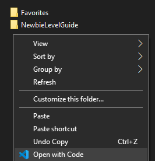
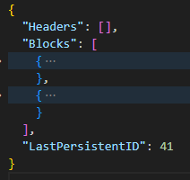

# Isolating a level

## Overview

This step isn't necessary (and in some ways it's better not to do this at all), but for learning purposes it's good to understand exactly what we'll be working with.

For this step we're going to trim the main datablocks that we'll be working with (specifically Rundown and LevelLayout) so that they only contain one level.

This also doubles as an exercise in using VS Code.

## Isolating blocks

### Setup

To start, we'll grab a copy of the unedited Rundown, LevelLayout and GameSetup datablocks. You can follow along with how to generate them using MTFO from [The Complete Newbie Guide](../the-complete-newbie-guide.md) or grab them from the archived versions at [OriginalDataBlocks](https://github.com/UntiIted/OriginalDataBlocks) . You can also view the final version of our edited datablocks here: [Final datablocks version page](final-datablocks-version.md). Put these inside a folder in the `GameData` directory of BepInEx. You'll have something like this:

<figure><figcaption>
<code>GameData</code> folder of BepInEx.
</figcaption></figure>

<figure><figcaption>
The datablocks inside our <code>GameData</code> folder.
</figcaption></figure>


MTFO can load datablocks directly from the `GameData` folder, but it is better to keep them organized in a separate folder. MTFO also used to support loading datablocks from the `plugins` folder instead, which is what you'll see in many mods and other guides (and even in other parts of this wiki!). Placing datablocks in the `GameData` folder is now preferred.


Open your `GameData` folder with VS Code.

<figure><figcaption>
Context menu to open the folder directly in VS Code.
</figcaption></figure>

### Deleting rundown blocks

Open the Rundown datablock and delete the headers.

.png>)


Headers have no impact on modded datablocks, deleting them is optional. They're used only by the devs in their editor tools.


Now we'll delete all but one rundown from the `"Blocks"` part of the datablock.

First, find the `"Tutorial Holder"` rundown's block. This contains the game's tutorial, and its presence is hardcoded so we can't delete it.

Go to the start of the block, collapse it, and copy it. (Or, if using VS Code, you can use `Control + Shift + [` to collapse the block your cursor is in).

 (1).png>)

Paste it at the bottom of the blocks.

Find the rundown that contains whichever level you'd like to use as a foundation. In this case, we'll use Rundown 6.

 (1) (1).png>)

Collapse it, copy it and paste it at the bottom of the blocks.

Delete all the other blocks, aside from our two at the bottom (it's easiest to do this by collapsing them all). Once we're down to just our two blocks you might need to fix some formatting. There should be a comma between our two blocks, but not one at the end.

<figure><figcaption>
The Rundown datablock trimmed to just two rundowns.
</figcaption></figure>

### Deleting all but one level from the rundown

We only have one rundown and we want to keep only one level in it. Let's go with B2.

Collapse all the tier blocks.

 (1).png>)

Delete everything but B tier.


Make sure you don't delete the tiers themselves, just leave them empty. Otherwise the rundown will not load correctly.


 (1).png>)

Confirm that the 2nd object in B tier is B2 "Contaminant" and collapse the tier blocks

 (1) (1).png>)

Delete all but the 2nd block.

 (1).png>)

B2 has now become B1 and is the only level in the rundown.


At the bottom of the rundown's block there is the `"persistentID"`. When the rundown's ID is not 1, GTFO API ensures all levels are unlocked, so we don't have to take care of that ourselves. If you want to include level progression, you'll have to set the ID to 1 and then use the "Accessibility", "UnlockedByExpedition", and "CustomProgressionLock" fields to control levels being unlocked.


### Deleting secondary layer

Contaminant is the only level in our rundown, but it still has a secondary layer. Let's _thoroughly_ remove the secondary layer from the Rundown datablock. We'll have to remove quite a few sections, see the image below for what we have to remove. We need to remove the bulkhead information from the main layer, and also a bunch of stuff from the secondary layer. After we're done, the secondary layer should look the same as the third layer.

 (1).png>)

### Deleting level layout blocks

Now we have to do the same to the LevelLayout datablock. We'll find the correct level layout ID and delete the rest.

In the picture above from our rundown block, you can see that `LevelLayoutData` is set to 162. That's our main layer level layout.

Open the LevelLayout datablock and find the block with this ID.

 (1) (1).png>)

Repeat the same process as for our rundown blocks: collapse it, copy it, collapse all blocks, delete them, paste the copied block, delete the comma.

Remember VS Code has to process over 200k lines here so don't be too harsh if it lags a bit. Deleting at least a part of the blocks does have practical use here as VS Code and its plugins won't take time to load when editing huge files like this one.

There should only be a few thousand lines left in this file.

### Modifying game setup datablock

Most of the work is now done, and we only have to do a minor tweak to the GameSetup datablock. Open it up and change the `"RundownIdsToLoad"` to only contain the rundown ID for your rundown. The rundown's ID is the `"PersistentID"` number at the bottom of the rundown's block.

### Regarding changing IDs

We talked briefly about changing the ID of our rundown block earlier. While this is not a necessary step anymore thanks to GTFO API, it was originally agreed with devs to change all custom rundowns' ID to 1. If you did do this, you'll obviously have to change the `"RundownIdsToLoad"` to match.

You're also allowed to change the LevelLayout block IDs. If you do so, then you'll have to change the `"LevelLayoutData"` from the rundown's block to match.

### Verifying

Remember to save everything.

Launch the game. You should now see only B1 in the rundown menu.

.png>)

Drop into the level. You should now have only the one rundown, and the level itself should load just fine. If you have freecam or some other mods, you can use them to check what the level looks like more easily. See if anything has changed.

You should see some marker (all sorts of objects placed in the level, a whole different topic) placement differences, also the lack of the secondary layer.

Oh and we deleted the bulkhead key, controller, and the bulkhead door (which is now just a security door) from the main layer. If you want to restore that, you can do so by restoring these 3 fields from the original datablock we kept as a backup (you did keep some as a backup, right?):

* ZonesWithBulkheadEntrance - zones in same layer (main) that have bulkhead entrances.
* BulkheadDoorControllerPlacements - where to place bulkhead door controllers. If a zone with a bulkhead entrance does not have a door controller, the entrance will not require a bulkhead key.
* BulkheadKeyPlacements - where to place bulkhead keys in the layer.

Make sure you restore the ones under `MainLayerData` and not secondary. You can also just copy the whole `MainLayerData` block.

Later sections of the guide will assume you restored these (or didn't delete them to begin with).

If you did actually restore and verify again, the terminal near the bulkhead might be near the zone door in front of the door controller now.

.png>)

The Rundown, LevelLayout and GameSetup blocks are now cleaned up and we can move onto the 2nd step in the guide.
