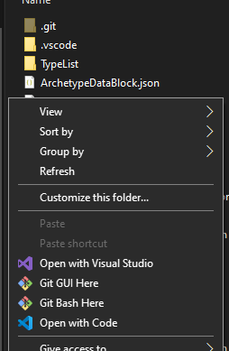

# ConfigurableGlobalWaveSettings

### Developer

Discord: Stormpooper#3436

### Prerequisites

This documentation assumes the user is familiar with base game [wave settings](../../reference/datablocks/survivalwavesettings.md) and [population](../../reference/datablocks/survivalwavepopulation.md).

### Fields


Note that the heat system is explained in its own section.


#### AllowedTotalCost - Float

Soft spawn cap. All aggressive enemies count towards this. The value of each enemy is set by EnemyTypeCostsTowardsCap

#### MaxHeat - Float

Max heat value used for weight calculations. The closer a type's heat is to max, the lower its spawn chance.

#### HeatCooldownSpeed - Float

How much to decrease heat of all types (that are not filtered out) each time an enemy is picked.

This value is actually 1 right now in base game, which causes some bugs. It's intended to be 25, which is the default for the mod.

#### BaseWeights - Float\[]

Array of 5 floats. Base chance to spawn each type.

#### HeatsOnSelect - Float\[]

Array of 5 floats. How much heat is added when this type is picked.

Note that before the type is picked, cooldown is applied.

Say, if the type had 50 heat, cooldown is 25, and heat on select is 150, you would end up with 175 heat afterwards.

#### HeatsAtStart - Float\[]

Array of 5 floats. How much heat each type has when starting a level.

In base game this value is never reset and carries on to other levels and attempts.

#### EnemyTypeCostsForWave - Float\[]

Array of 5 floats. How much this type costs for wave populationPoints settings when picked.

#### EnemyTypeCostsTowardsCap - Float\[]

Array of 5 floats. Type is taken from EnemyDataBlock and is added towards AllowedTotalCost when enemy turns aggressive.

The 5 floats here are actually the same field as EnemyTypeCostsForWave in base game but are separated in this mod, since the types are separate in base game.

#### WaveEnemyTypeLimits - Int\[]

Array of 5 ints. Currently broken, only matters if the value is above 0. This type can't spawn otherwise (as is the case for Boss role in base game).

#### PersistentID

Effectively the same as ID of normal blocks. Duplicates are ignored.

### How to use

#### Making and using blocks

After first launching the game with the mod installed, a json file will generate in `BepInEx\plugins\PersistentData\ConfigurableGlobalWaveSettings`

This json is a pseudo-datablock containing the settings blocks, referenced from RundownDataBlock with PersistentID.

To select settings for a level, add the text "globalwavesettings\_\[ID]" (case-insensitive) to DevInfo of your level in RundownDataBlock. The mod searches for the pattern, not exact match, so it doesn't matter how much or what text is specified as long as this pattern exists in it.

.png>)

If a level does not have anything specified, the block with ID 1 will be used unless it doesn't exist. These settings are close to real game settings but with some bug fixes.

#### Exporting

Rundown developers should add this mod as a dependency and add the json file with this folder structure: `plugins\PersistentData`\\`ConfigurableGlobalWaveSettings\GlobalWaveSettingsDataBlock.json`

### How heat works

Heat is used for a weighted RNG system. Simply put, the higher the heat of a type is, the lower its spawn chance. Heat cannot go below 0.

The game picks enemies to spawn one-by-one following this process:

1. Filter the types using wave settings;
2. Filter out types that exceed spawn count limits (broken, only matters if limit is set to 0);
3. Apply cooldown to all remaining types;
4. Set weight of types exceeding max heat to 0;
5. For other types, calculate weight like so: `(1 - heat / maxHeat) * baseWeight`
6. Using weights, semi-randomly select a type;
7. &#x20;If not all types are filtered out, but all weights are 0, the first type remaining after filtering is picked.
8. If selection failed, return type `Standard`.

* Note: thanks to the selection algorithm, heats can be driven way over max heat (e.g. if wave settings only allow MiniBoss spawns). The settings are global, so they persist to other waves, possibly distorting spawns until normal heat values are restored via cooldown.

So let's say we have MiniBoss with 150 heat and base chance 0.15. The cooldown is 25. Assuming it's not filtered out, its weight would be: `(1 - 125 / 200) * 0.15 = 0.05625`

This does not mean it has a 5.6% chance to spawn, to calculate that you would need to know the weights of other types as well.

Now let's say max heat is 200, cooldown is 25, and the initial heat of MiniBoss is set to 500. In this case even if it's not filtered out, MiniBoss cannot spawn until the \~12th pick. If it is filtered out, its heat won't decrease until we have an alarm (or scout wave) that does allow MiniBoss spawns.

### Base game bugs fixed by default

Even with no settings selected, block ID 1 is picked, which is game defaults with 3 bugs fixed:

* Cooldown speed is reverted to intended value (25 as opposed to 1 set by game at the time of writing)
* Heat is reset on each level attempt
* Boss role is enabled

### Mod logs

When info logging is enabled, this mod will log ID selection.

When debug logging is enabled, this mod will log wave spawns.
